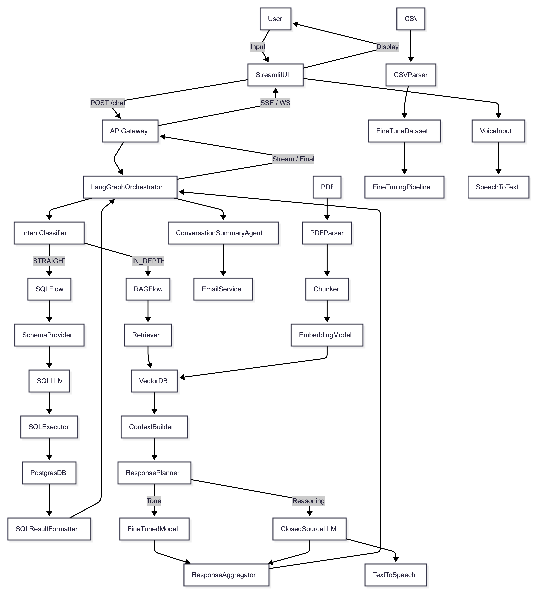
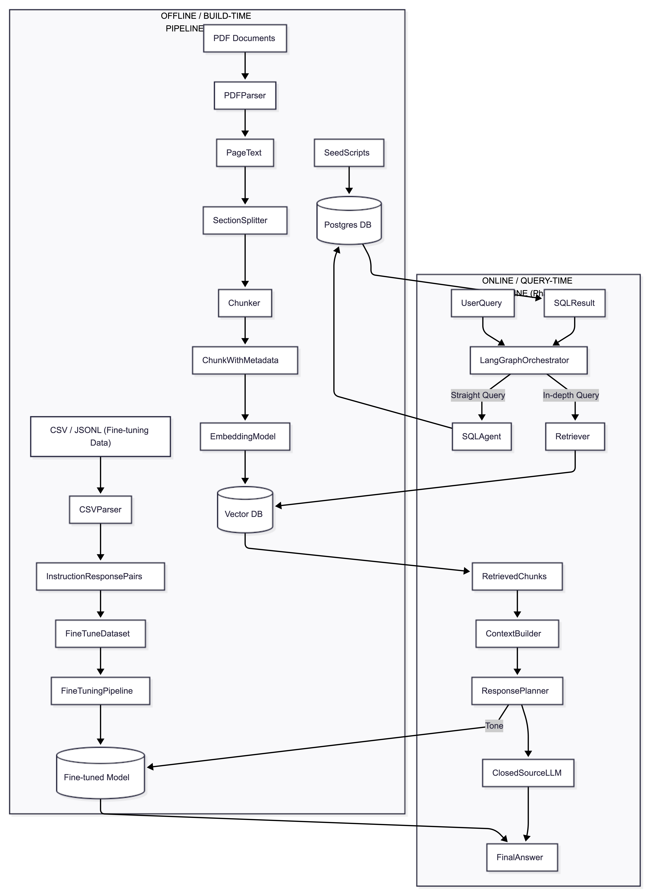
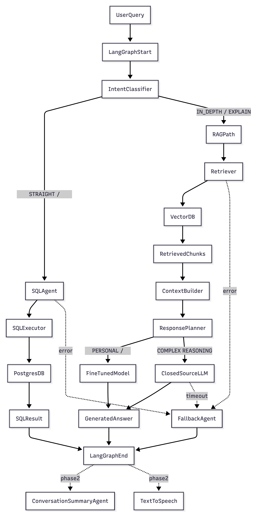

# Smart CV: AI-Powered Interactive Portfolio

## Overview
**Smart CV** is a next-generation interactive resume powered by Large Language Models (LLMs). Unlike static PDFs, this system allows recruiters and hiring managers to **chat** with a professional persona of the candidate.

It leverages **Structured Data** (SQL) for precise career stats and **Unstructured Data** (RAG) for in-depth project narratives, offering a comprehensive and engaging way to explore a professional background.

## System Architecture

The system is built on a robust architecture comprising an **Offline Data Pipeline** for creating the knowledge base and an **Online Query Engine** for real-time interaction.

### 1. High-Level Architecture
The core system integrates a **Streamlit** frontend with a **LangGraph** orchestrator. It intelligently routes user queries to the most appropriate agent.

### 2. Decision Routing (The Brain)
Every user query is analyzed by an **Intent Classifier** to determine the best retrieval strategy:
*   **Straight Query**: Fetches hard facts (e.g., "Years of experience", "Tech stack") from the SQL database.
*   **In-Depth Query**: Retrieves context from the Resume PDF via RAG (e.g., "Explain the challenges in project X").
*   **Personal/Tone**: Uses a Fine-Tuned Model to answer personal questions in the candidate's specific voice.
*   **Complex Reasoning**: Delegates complex scenarios to advanced LLMs.

### 3. Workflow Orchestration
**LangGraph** manages the state and flow of the conversation, ensuring seamless transitions between different agents and handling fallbacks gracefully.

---

## Core Features

### 🧠 **Intelligent Interaction**
*   **Interactive Chat**: Ask anything about the candidate's experience.
*   **Multimodal**: Supports **Voice Input** and **Audio Output** for a natural conversation.
*   **Smart Routing**: Differentiates between factual data requests and descriptive questions.

### 📚 **Data & Knowledge**
*   **Structured Knowledge (SQL)**: A Postgres database stores structured stats (Education, Experience timeline, Skills).
*   **Unstructured Knowledge (RAG)**: A Vector Database stores the semantic content of the Resume PDF and Portfolio.
*   **Personalized Persona**: A Fine-tuned model ensures responses reflect the candidate's unique professional style.

### 🚀 **Deployment**
The entire application is cloud-native and designed for deployment on **AWS**.
*   **Containerization**: Dockerized services for consistency.
*   **Cloud Infrastructure**: Hosted on AWS (ECS/EC2) for scalability and availability.

---

## Technical Workflows

### Offline Pipeline (Build Time)
1.  **Resume Ingestion**:
    *   PDFs are parsed, chunked, and embedded into a **Vector Database**.
2.  **Fine-Tuning**:
    *   Structured data (CSV/JSONL) is converted into instruction-response pairs to train the "Persona" model.
3.  **SQL Seeding**:
    *   Career stats are loaded into **PostgreSQL**.

### Online Pipeline (Runtime)
1.  **User Input**: Text or Voice query received via Streamlit.
2.  **Intent Classification**: System decides: *SQL vs. RAG vs. Chit-chat*.
3.  **Execution**:
    *   *SQL Agent*: Generates and runs SQL queries.
    *   *Retriever*: Fetches document context.
4.  **Response Generation**: The `ResponsePlanner` synthesizes the final answer.
5.  **Delivery**: Response streamed back to UI (and converted to speech if enabled).
